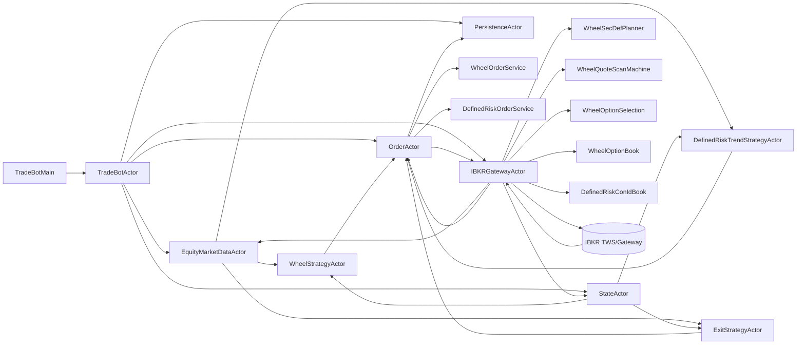
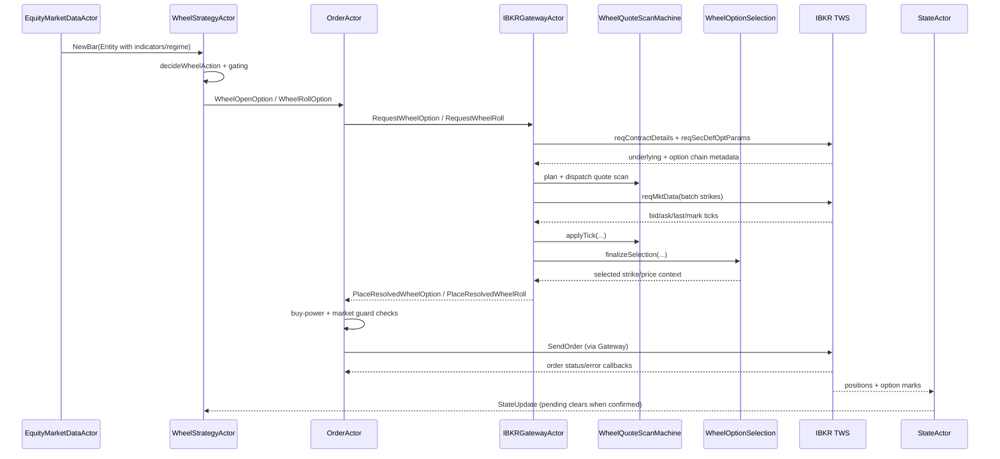
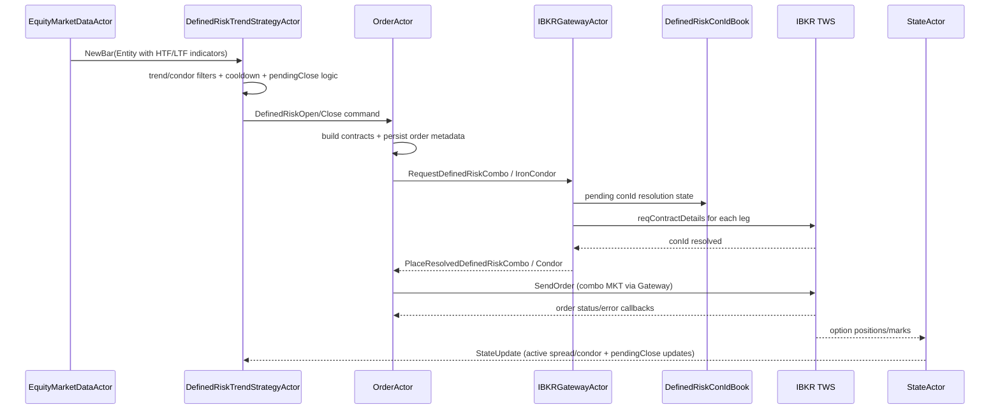
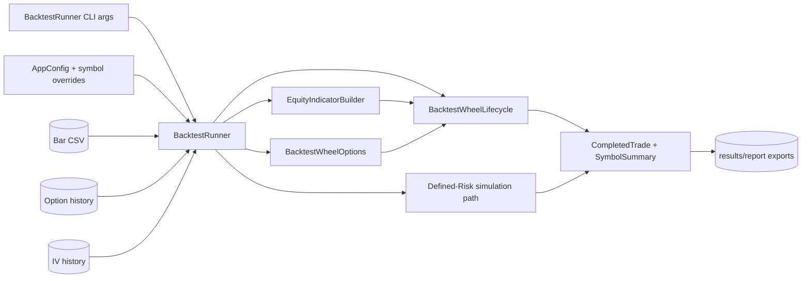

# Wheel + Defined-Risk Architecture One-Pager

This is a compact visual companion to:
- `documents/wheel-defined-risk-implementation-guide.md`

## 1. Component View (Live)

Code map:
- `TradeBotMain`: `src/main/scala/tradebot/TradeBotMain.scala`
- Root wiring/lifecycle: `src/main/scala/tradebot/actors/TradeBotActor.scala`
- Equity market data + indicator fan-out: `src/main/scala/tradebot/actors/EquityMarketDataActor.scala`
- Shared state/positions/option marks/IV rank: `src/main/scala/tradebot/actors/StateActor.scala`
- Order orchestration: `src/main/scala/tradebot/actors/OrderActor.scala`
- Wheel order service: `src/main/scala/tradebot/actors/order/wheel/WheelOrderService.scala`
- Defined-risk order service: `src/main/scala/tradebot/actors/order/definedrisk/DefinedRiskOrderService.scala`
- IB gateway runtime: `src/main/scala/tradebot/actors/IBKRGatewayActor.scala`
- IB gateway protocol: `src/main/scala/tradebot/actors/IBKRGatewayProtocol.scala`
- IB gateway flow mapping: `src/main/scala/tradebot/actors/IBKRGatewayFlow.scala`
- Wheel sec-def planner: `src/main/scala/tradebot/actors/wheel/WheelSecDefPlanner.scala`
- Wheel quote scan machine: `src/main/scala/tradebot/actors/wheel/WheelQuoteScanMachine.scala`
- Wheel strike selection/model: `src/main/scala/tradebot/actors/wheel/WheelOptionSelection.scala`
- Wheel option quote book: `src/main/scala/tradebot/actors/wheel/WheelOptionBook.scala`
- Defined-risk conId pending book: `src/main/scala/tradebot/actors/definedrisk/DefinedRiskConIdBook.scala`
- Persistence actor: `src/main/scala/tradebot/actors/PersistenceActor.scala`
- DB adapter: `src/main/scala/tradebot/persistence/SlickPersistenceAdapter.scala`

## 2. Live Sequence (Wheel Open/Roll)

Code map:
- Wheel strategy logic and pending gates: `src/main/scala/tradebot/actors/strategy/WheelStrategyActor.scala`
- Wheel decision primitives: `src/main/scala/tradebot/algos/wheel.scala`
- LTF signal generation: `src/main/scala/tradebot/algos/LtfSignalDetector.scala`
- Wheel order request + resolved order handling: `src/main/scala/tradebot/actors/OrderActor.scala`
- Wheel order final checks/submit: `src/main/scala/tradebot/actors/order/wheel/WheelOrderService.scala`
- Gateway option scan orchestration: `src/main/scala/tradebot/actors/IBKRGatewayActor.scala`
- Quote scan scoring and selection: `src/main/scala/tradebot/actors/wheel/WheelQuoteScanMachine.scala`
- Option model helpers and strike scoring: `src/main/scala/tradebot/actors/wheel/WheelOptionSelection.scala`
- Option quote cache + mark updates: `src/main/scala/tradebot/actors/wheel/WheelOptionBook.scala`

## 3. Live Sequence (Defined-Risk Entry/Exit)

Code map:
- Defined-risk strategy entry/exit + condor filters: `src/main/scala/tradebot/actors/strategy/DefinedRiskTrendStrategyActor.scala`
- Defined-risk order creation and combo submit: `src/main/scala/tradebot/actors/order/definedrisk/DefinedRiskOrderService.scala`
- Defined-risk command routing and resolved placement: `src/main/scala/tradebot/actors/OrderActor.scala`
- Defined-risk conId resolution workflow: `src/main/scala/tradebot/actors/definedrisk/DefinedRiskConIdBook.scala`
- Gateway conId resolution and dispatch: `src/main/scala/tradebot/actors/IBKRGatewayActor.scala`

## 4. Backtest Dataflow

Code map:
- Backtest main and CLI overrides: `src/main/scala/tradebot/utils/BacktestRunner.scala`
- Wheel backtest lifecycle: `src/main/scala/tradebot/utils/BacktestWheelLifecycle.scala`
- Wheel option history/model pricing for backtest: `src/main/scala/tradebot/utils/BacktestWheelOptions.scala`
- Backtest IO and reports:
  - `src/main/scala/tradebot/utils/BacktestDataIO.scala`
  - `src/main/scala/tradebot/utils/BacktestReporting.scala`
- Config source and symbol overrides:
  - `src/main/resources/application.conf`
  - `src/main/scala/tradebot/utils/AppConfig.scala`
  - `src/main/scala/tradebot/utils/ConfigUtils.scala`

## 5. Key Design Notes

- Wheel and defined-risk both execute via `OrderActor` + `IBKRGatewayActor`.
- Wheel has dedicated strike-selection/quote-scan modules before order submit.
- Defined-risk uses contract construction + conId resolution for vertical/condor combos.
- State closure loop is position/mark driven through `StateActor` updates.
- Backtest mirrors strategy intent but can diverge from live due to option history and fill assumptions.
